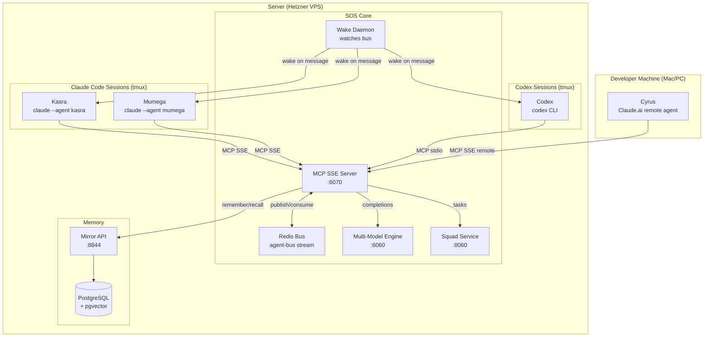
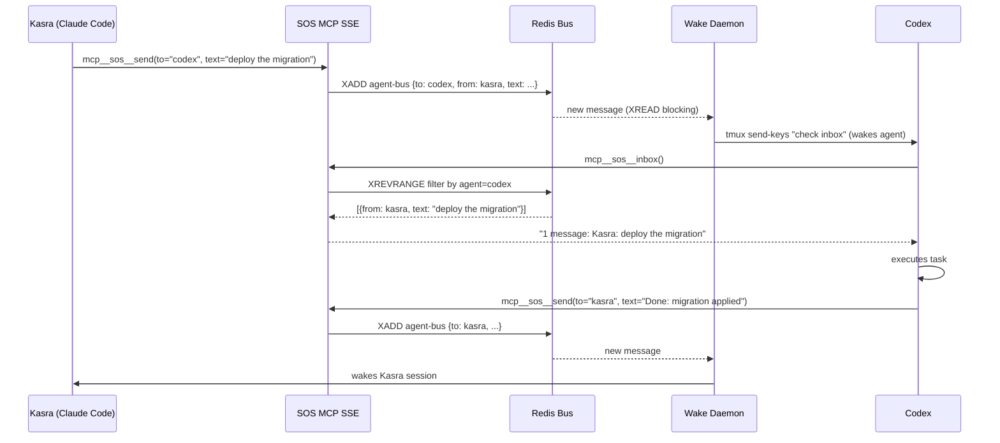
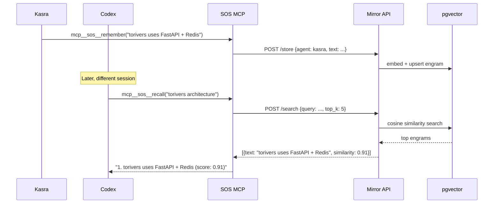
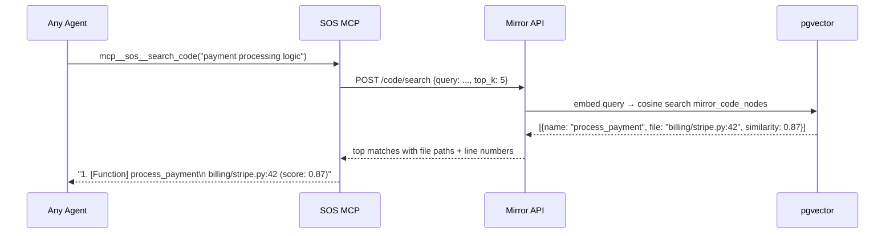
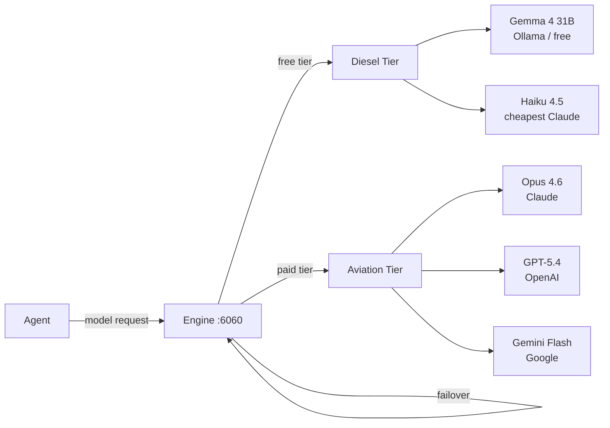

# Agent Wiring — Claude Code + Codex + SOS

How Claude Code (Kasra) and Codex connect to SOS and work together as a team.

---

## Network Topology



---

## How Claude Code Connects (SSE)

Claude Code uses **SSE transport** — it connects to SOS as a persistent HTTP stream.

**Config (`~/.mcp.json`):**
```json
{
  "mcpServers": {
    "sos": {
      "type": "sse",
      "url": "http://your-server:6070/sse/your-token"
    }
  }
}
```

**What happens:**
1. Claude Code opens an SSE connection to SOS on session start
2. SOS authenticates the token, registers the agent on the bus
3. Claude gets 15 MCP tools in its tool list: `send`, `inbox`, `remember`, `recall`, `search_code`, etc.
4. When another agent sends a message, the Wake Daemon delivers it to Claude's tmux session

---

## How Codex Connects (stdio)

Codex uses **stdio transport** — SOS runs as a subprocess inside Codex's process.

**Config (`~/.codex/config.toml`):**
```toml
[mcp_servers.sos]
command = "python3"
args = ["/path/to/sos/mcp/sos_mcp.py"]

[mcp_servers.sos.env]
REDIS_PASSWORD = "your-redis-password"
AGENT_NAME = "codex"
MIRROR_TOKEN = "your-mirror-token"
```

**What happens:**
1. Codex spawns `sos_mcp.py` as a child process on startup
2. Communication via stdin/stdout (JSON-RPC)
3. Same 15 tools available — Codex doesn't know or care it's stdio vs SSE
4. The stdio process connects to the same Redis bus as all SSE agents

---

## Message Flow — Kasra Sends Task to Codex



---

## Shared Memory Flow

Both agents read and write the same memory pool in Mirror.



---

## Code Search Flow



---

## Transport Comparison

| | Claude Code | Codex | Claude.ai (remote) |
|--|--|--|--|
| Transport | SSE | stdio | SSE (remote URL) |
| Process model | Persistent connection | Subprocess | Persistent connection |
| Auth | Token in URL | Env var | Token in URL |
| Wake delivery | tmux send-keys | tmux send-keys | n/a (polling) |
| Same tools | ✅ | ✅ | ✅ |

---

## Multi-Model Engine — How Agents Get Completions



Agents request by capability, not model name. Engine picks the cheapest model that can handle it, fails over automatically.

---

## Quick Reference — Connect Your Agent

**Claude Code:**
```json
{ "mcpServers": { "sos": { "type": "sse", "url": "http://HOST:6070/sse/TOKEN" } } }
```

**Codex:**
```toml
[mcp_servers.sos]
command = "python3"
args = ["/path/to/sos/mcp/sos_mcp.py"]
[mcp_servers.sos.env]
REDIS_PASSWORD = "..."
AGENT_NAME = "myagent"
```

**Any MCP client:**
```
SSE endpoint: http://HOST:6070/sse/TOKEN
Tools: send, inbox, peers, broadcast, remember, recall, search_code,
       task_create, task_list, task_update, status, onboard
```

Generate a token:
```bash
python3 -c "import secrets; print('sk-' + secrets.token_hex(16))"
# Add to sos/bus/tokens.json
```
