# Viamar Ad Pipeline — SCADA Control Document
**Version:** 1.0  
**Date:** 2026-04-15  
**Author:** Mumega / Kasra  
**Scope:** Complete flow from ad impression to signed contract, referral loop closure

---

## System Overview

This document describes the full advertising pipeline for Viamar International Shipping as a control system. Every stage is a process unit. Every conversion rate is a valve. Every metric is a sensor reading. Every tool is a subsystem.

Total daily spend: **$105/day** across Google Ads ($80) + Meta ($25)  
Expected monthly revenue generated: **$42,000–$59,500**  
Target ROAS: **13x–19x**

---

## Master Pipeline Map

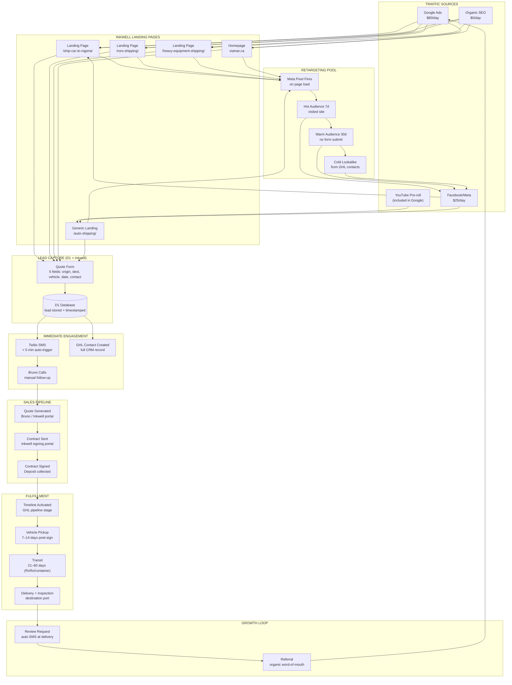

---

## Pipeline 1: Google Ads Flow

### Campaign Architecture

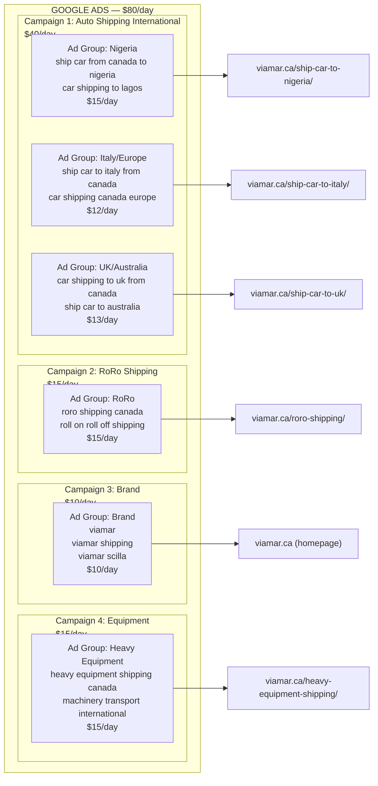

### Flow with Conversion Valves

```mermaid
flowchart TD
    IMP["[M1] Ad Impression\n1,000–2,000/day\nTool: Google Ads\nCost: $0.03–0.08 CPM"]
    
    V1{{"VALVE: CTR\n3–5%"}}
    
    CLK["[M2] Ad Click\n30–100/day\nTool: Google Ads\nCost: $2.50–4.00 CPC avg\nTime: immediate"]
    
    V2{{"VALVE: Bounce Rate\n<50%\n(quality score gate)"}}
    
    PV["[M3] Engaged Page View\n15–50/day\nTool: GA4\nCost: $0 (already paid)\nTime: 0–30 sec"]
    
    V3{{"VALVE: Form Conversion\n5–10%"}}
    
    FORM["[M4] Quote Form Submitted\n2–5/day\nTool: Inkwell + D1\nCost: $20–40 per lead\nTime: 1–5 min browsing"]
    
    V4{{"VALVE: Lead Capture\n95%+"}}
    
    LEAD["[M5] Lead in D1\n2–5/day stored\nTool: D1 / Inkwell API\nCost: $0\nTime: <1 sec (async)"]
    
    V5{{"VALVE: SMS Delivery\n99%"}}
    
    SMS["[M6] SMS Sent to Bruno\nTool: Twilio\nCost: $0.01/msg\nTime: <5 min from form submit"]
    
    V6{{"VALVE: Quote Rate\n60–80%"}}
    
    QUOTE["[M7] Quote Sent to Customer\nTool: Inkwell portal / email\nCost: $0\nTime: same day or next day"]
    
    V7{{"VALVE: Contract Send Rate\n40–60%"}}
    
    CONTRACT["[M8] Contract Sent\nTool: Inkwell signing portal\nCost: $0\nTime: 1–3 days post-quote"]
    
    V8{{"VALVE: Close Rate\n30–50%"}}
    
    SIGNED["[M9] Contract Signed + Deposit\nTool: Inkwell / Stripe\nCost: $0\nTime: 1–5 days post-contract\nRevenue: $3,500 avg job"]

    IMP --> V1 --> CLK --> V2 --> PV --> V3 --> FORM --> V4 --> LEAD --> V5 --> SMS --> V6 --> QUOTE --> V7 --> CONTRACT --> V8 --> SIGNED
```

### Google Ads Copy Templates

#### Campaign 1 — Auto Shipping International

**Ad 1 (Nigeria)**
```
Headline 1: Ship Your Car to Nigeria
Headline 2: From Any Canadian City | Viamar
Headline 3: Get a Free Quote in 60 Seconds
Description 1: Door-to-port and port-to-port car shipping from Canada to Lagos, Apapa, Tin Can Island. RoRo & container available.
Description 2: Trusted by hundreds of Canadians shipping home. Get your instant quote — we handle everything including customs.
```

**Ad 2 (Italy/Europe)**
```
Headline 1: Ship Your Car to Italy or Europe
Headline 2: Canada → Civitavecchia | Viamar
Headline 3: RoRo Shipping Experts Since Day 1
Description 1: Affordable RoRo and container shipping from Canada to Italy, Germany, UK, and all major European ports.
Description 2: Licensed freight forwarder. Over 50 destinations. Get a quote online — ships depart weekly from Montreal & Halifax.
```

**Ad 3 (UK/Australia)**
```
Headline 1: Shipping Your Car to the UK?
Headline 2: Canada to Southampton | Viamar
Headline 3: Weekly Sailings — Get a Quote Now
Description 1: Reliable car shipping from Canada to UK, Australia, and New Zealand. RoRo and shared container options.
Description 2: Competitive rates, real tracking, and a team that answers the phone. Book your shipment in minutes.
```

#### Campaign 2 — RoRo Shipping

**Ad 1**
```
Headline 1: RoRo Shipping from Canada
Headline 2: Roll-On Roll-Off | $600+ Savings
Headline 3: 50+ Destinations | Viamar
Description 1: RoRo (Roll-On Roll-Off) is the most cost-effective way to ship your car internationally. Drive it on, sail it over.
Description 2: We ship vehicles weekly to Africa, Europe, the Caribbean, and the Middle East. Get your quote in 60 seconds.
```

**Ad 2**
```
Headline 1: What Is RoRo Car Shipping?
Headline 2: Cheapest Way to Ship Abroad
Headline 3: Free Quote | Viamar Canada
Description 1: RoRo shipping means your car drives onto the vessel — no crating, no container. Cheaper, faster, proven.
Description 2: Perfect for Nigeria, Ghana, UK, Italy, and 40+ more ports. Viamar handles all customs paperwork.
```

**Ad 3**
```
Headline 1: RoRo Car Shipping — Canada
Headline 2: Halifax, Montreal, Vancouver
Headline 3: Get a Quote in 60 Seconds
Description 1: Departures from Halifax and Montreal to major world ports. We handle export docs, customs clearance, and delivery.
Description 2: Vehicles shipped safely on modern RoRo vessels. Competitive rates. No hidden fees. Viamar since [year].
```

#### Campaign 3 — Brand

**Ad 1**
```
Headline 1: Viamar — International Car Shipping
Headline 2: Canada's Trusted Vehicle Exporter
Headline 3: Get a Free Shipping Quote
Description 1: Viamar ships vehicles and equipment from Canada to 50+ countries. RoRo, container, and heavy lift options.
Description 2: Fast quotes, customs expertise, real tracking. Hundreds of satisfied customers worldwide.
```

**Ad 2**
```
Headline 1: Viamar Scilla — Car Shipping
Headline 2: 50+ Countries | Weekly Sailings
Headline 3: Quote in 60 Seconds
Description 1: Looking for Viamar? Get your international car shipping quote right here. We ship from all major Canadian ports.
Description 2: Trusted, licensed, experienced. Your vehicle is in safe hands from pickup to destination port.
```

**Ad 3**
```
Headline 1: Viamar — Book Your Car Shipment
Headline 2: Canada to the World | Since [Year]
Headline 3: Start Your Quote Today
Description 1: Viamar International Shipping — your partner for vehicle exports from Canada to Africa, Europe, and beyond.
Description 2: We make international car shipping simple. Get a quote, sign online, we handle the rest.
```

#### Campaign 4 — Heavy Equipment

**Ad 1**
```
Headline 1: Heavy Equipment Shipping Canada
Headline 2: Machinery & Construction Transport
Headline 3: Viamar — Licensed Freight Forwarder
Description 1: Ship excavators, tractors, construction machinery, and heavy equipment from Canada to any world port.
Description 2: Flat rack, RoRo, and breakbulk options. We handle all customs, lashing, and port logistics.
```

**Ad 2**
```
Headline 1: Ship Machinery from Canada
Headline 2: Oversized Cargo Specialists
Headline 3: Get a Heavy Lift Quote
Description 1: Viamar moves heavy and oversized equipment internationally. From a single machine to full project cargo.
Description 2: Serving construction, mining, and agriculture industries. Quotes within 24 hours. Call or submit online.
```

**Ad 3**
```
Headline 1: Construction Equipment Export
Headline 2: Canada → Africa, Europe, Middle East
Headline 3: Viamar Project Cargo Team
Description 1: Your equipment arrives safely with Viamar's project cargo service. Flat rack, heavy lift, and RoRo vessels.
Description 2: We know the ports. We know the paperwork. Get a quote for your next equipment export today.
```

---

## Pipeline 2: YouTube Pre-Roll Flow

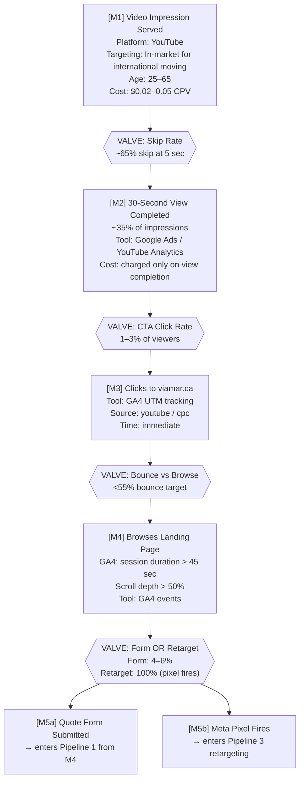

### YouTube Pre-Roll Ad Scripts

#### 15-Second Version (non-skippable)
```
[0–3 sec — HOOK]
"Moving back home? Taking your car with you?"

[3–10 sec — VALUE]
"Viamar ships vehicles from Canada to over 50 countries.
Nigeria, Italy, UK, Australia — we handle customs, paperwork, everything."

[10–15 sec — CTA]
"Get your free shipping quote at viamar.ca.
Takes 60 seconds."

[VISUAL: Car driving onto RoRo vessel, overlaid with destination flags]
[SUPER: viamar.ca | Get a Free Quote]
```

#### 30-Second Version (skippable — hook must land by 5 sec)
```
[0–5 sec — HOOK (must survive skip)]
"Shipping your car back to Nigeria? Italy? The UK?
Most Canadians have no idea how affordable it actually is."

[5–15 sec — PROBLEM + SOLUTION]
"Finding a reliable international car shipper is stressful.
Wrong company — your car disappears for 3 months.
Viamar has shipped hundreds of vehicles from Canada to over 50 countries.
RoRo, container — we match you to the right service."

[15–22 sec — PROOF]
"Weekly sailings from Halifax and Montreal.
We handle export paperwork, customs clearance, and real-time updates."

[22–30 sec — CTA]
"Go to viamar.ca — get your free quote in 60 seconds.
Put in your vehicle details and destination, we call you same day."

[VISUAL: Customer testimonial clip → car on vessel → delivery at port]
[SUPER throughout: viamar.ca | Free Quote in 60 Seconds]
```

---

## Pipeline 3: Facebook Retargeting Flow

### Audience Architecture

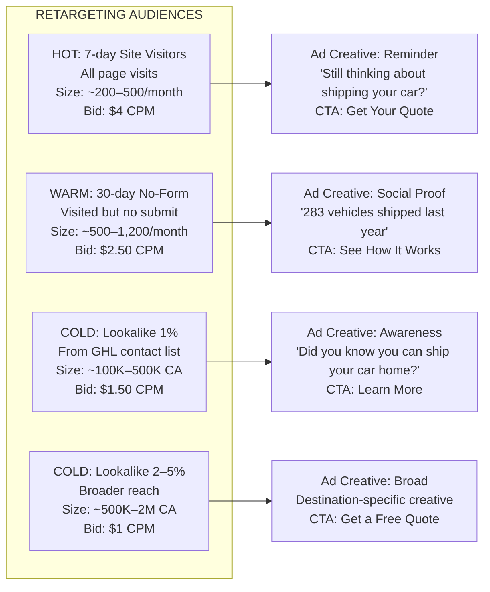

### Retargeting Pipeline Flow

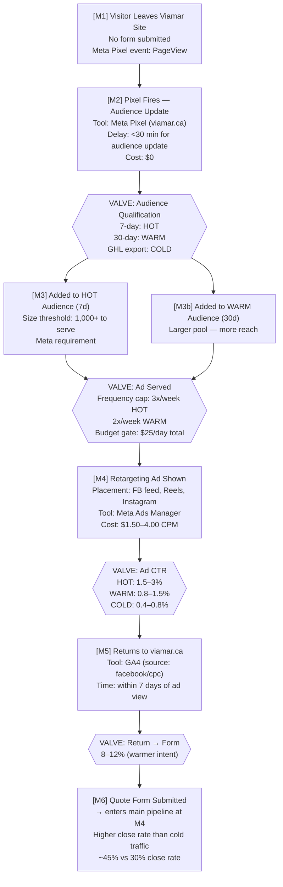

### Facebook Retargeting Ad Copy

#### Variant 1 — HOT (7-day visitors, reminder)
```
HEADLINE: Still thinking about shipping your car?
BODY: You visited Viamar recently — and we don't want you to miss your sailing window. 
Vessels fill up fast for Nigeria, Italy, and the UK.
Get your free quote today. It takes 60 seconds and we call you same day.
CTA BUTTON: Get My Quote
VISUAL: Split — left: car at Canadian port / right: destination city skyline
```

#### Variant 2 — WARM (30-day, social proof)
```
HEADLINE: 283 vehicles shipped in 2025. Yours could be next.
BODY: Canadians returning home to Nigeria, Italy, Ghana, the UK — they all chose Viamar.
RoRo shipping from Halifax and Montreal. We handle customs, paperwork, and real tracking.
Your free quote is one form away.
CTA BUTTON: See How It Works
VISUAL: Customer photo with car at destination port (with permission) or stock equivalent
```

#### Variant 3 — COLD lookalike (awareness play)
```
HEADLINE: Did you know you can ship your car from Canada?
BODY: If you're relocating internationally — or sending a vehicle back home — RoRo shipping is more affordable than most people think.
Viamar ships from Canadian ports to 50+ countries. Nigeria, Italy, UK, Australia, Germany.
Get a free quote in 60 seconds. No commitment.
CTA BUTTON: Get a Free Quote
VISUAL: Clean video — car driving onto vessel with destination text overlay
```

---

## Pipeline 4: Organic SEO Flow

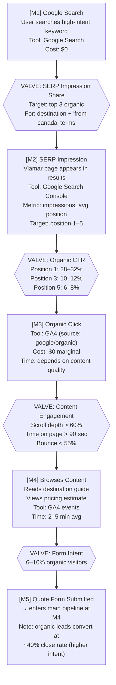

### Target SEO Keyword Clusters

```
CLUSTER: Auto Shipping International (Primary)
├── ship car from canada to nigeria [est. 200/mo]
├── car shipping canada to nigeria [est. 150/mo]
├── ship car to italy from canada [est. 120/mo]
├── auto transport canada to uk [est. 180/mo]
├── car shipping from canada to australia [est. 100/mo]
└── international car shipping from canada [est. 400/mo]

CLUSTER: RoRo Shipping (Secondary)
├── roro shipping canada [est. 150/mo]
├── roll on roll off shipping canada [est. 80/mo]
├── roro car shipping [est. 220/mo]
└── roro shipping from halifax [est. 60/mo]

CLUSTER: Heavy Equipment (Tertiary)
├── heavy equipment shipping canada [est. 90/mo]
├── machinery transport international canada [est. 50/mo]
└── export heavy equipment from canada [est. 40/mo]

CLUSTER: Brand + Local
├── viamar shipping [brand]
├── international car shipping toronto [est. 60/mo]
├── car export montreal [est. 45/mo]
└── vehicle shipping halifax [est. 35/mo]
```

---

## SCADA Measurement Dashboard

### Complete Sensor Map

```
STAGE                      METRIC                TARGET           TOOL
────────────────────────────────────────────────────────────────────────────────
[M1] Ad Impression         impressions/day        1,000–3,000      Google/Meta Ads
[M2] Ad Click              clicks/day             30–80            Google/Meta Ads
[M2] CPC                   cost per click         $2.00–5.00       Google Ads
[M3] Landing Page          bounce rate            <50%             GA4
[M3] Page Quality          scroll depth >50%      >60% sessions    GA4 events
[M4] Quote Form            form starts/day        5–15             Inkwell / GA4
[M4] Form Completion       completion rate        70–80%           Inkwell / GA4
[M5] Lead Captured         leads/day              3–10             D1 / Inkwell
[M5] CPL                   cost per lead          $12–30           calculated
[M6] SMS Sent              delivery rate          >99%             Twilio
[M6] Response Time         time to first contact  <5 min           Inkwell log
[M7] Quote Rate            leads → quotes sent    60–80%           GHL / manual
[M7] Quote Time            time to quote          same day         Bruno / GHL
[M8] Contract Send         quotes → contracts     40–60%           Inkwell portal
[M9] Close Rate            contracts → signed     30–50%           Inkwell portal
[M9] CPCust                cost per customer       $40–120          calculated
[F1] Fulfillment           pickup time            7–14 days        GHL pipeline
[F2] Transit               delivery time          21–60 days       GHL pipeline
[F3] Review                review request rate    100%             auto SMS
[F4] Review Response       review completion      20–30%           auto SMS
[F5] Referral              referral rate          10–15%           tracking link
```

### Funnel Math (Monthly)

```
GOOGLE ADS ($80/day = $2,400/mo)
───────────────────────────────────────────────────────
Impressions:        45,000/mo    (1,500/day avg)
Clicks:             1,350/mo     (30/day @ 3% CTR)
Engaged sessions:   675/mo       (50% bounce filtered)
Form submissions:   40/mo        (6% conversion)
Leads captured:     38/mo        (95% capture rate)
Quotes sent:        27/mo        (70% quote rate)
Contracts sent:     14/mo        (50% of quotes)
Signed contracts:   5–6/mo       (38% close rate)
Revenue:            $17,500–21,000/mo
ROAS:               7.3x–8.8x

META ADS ($25/day = $750/mo)
───────────────────────────────────────────────────────
Impressions:        30,000/mo    (retargeting pool)
Clicks:             300/mo       (1% blended CTR)
Form submissions:   24/mo        (8% warmer return)
Leads captured:     23/mo
Quotes sent:        17/mo        (73% quote rate)
Contracts sent:     10/mo
Signed contracts:   4–5/mo       (42% close rate — warmer)
Revenue:            $14,000–17,500/mo
ROAS:               18.7x–23.3x

ORGANIC SEO ($0/mo)
───────────────────────────────────────────────────────
Organic sessions:   200/mo       (growing — 6 months to rank)
Form submissions:   16/mo        (8% conversion — higher intent)
Leads captured:     15/mo
Quotes sent:        11/mo
Signed contracts:   4–5/mo       (40% close rate)
Revenue:            $14,000–17,500/mo
ROAS:               infinite

TOTAL COMBINED
───────────────────────────────────────────────────────
Monthly leads:      76/mo
Monthly quotes:     55/mo
Monthly contracts:  34/mo
Monthly closes:     13–16/mo
Monthly revenue:    $45,500–56,000/mo
Monthly ad spend:   $3,150
ROAS:               14.4x–17.8x
```

---

## Audience Definitions (Complete)

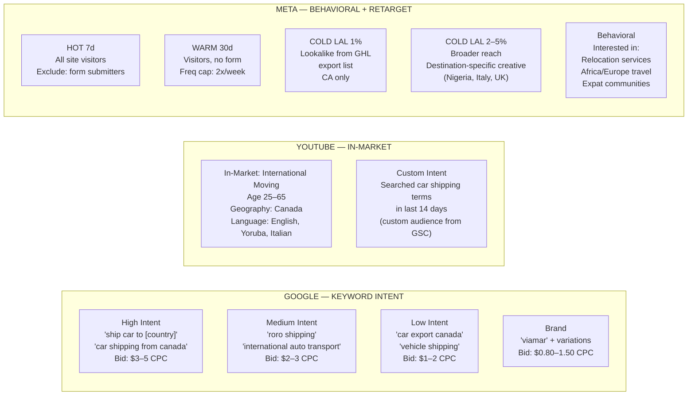

---

## Weekly Optimization Cycle (SCADA Control Loop)

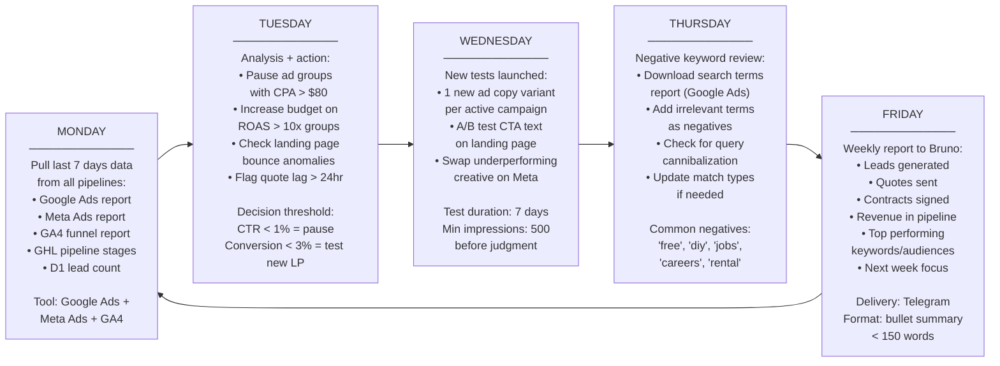

---

## Fulfillment Pipeline (Post-Signature)

```mermaid
flowchart TD
    SIGNED["CONTRACT SIGNED\nDeposit collected\nGHL stage: Won"]
    
    T1["[F1] Timeline Activated\nGHL pipeline: Active Jobs\nTasks auto-created:\n• Confirm pickup date\n• Prepare export docs\n• Customer prep checklist sent via SMS\nTime: same day as signature"]
    
    T2["[F2] Vehicle Pickup\nTime: 7–14 days post-sign\nMeasure: pickup adherence rate\nTarget: >90% on-time\nGHL task: Pickup Confirmed"]
    
    T3["[F3] Vessel Loading\nRoRo drive-on or container stuff\nExport declaration filed\nBill of Lading issued\nGHL task: BL Issued\nTime: 1–5 days after pickup"]
    
    T4["[F4] Vessel Departure\nTracking link sent to customer\nETA communicated\nGHL stage: In Transit\nTransit: 21–60 days by destination"]
    
    T5["[F5] Arrival Notification\nGHL task: Notify Customer\nCustoms clearance support\nGHL stage: Arrived"]
    
    T6["[F6] Customer Pickup at Port\nDelivery confirmed\nGHL stage: Delivered\nMetric: customer satisfaction 1–5"]
    
    T7["[F7] Review Request\nAuto SMS: 24 hrs after delivery\n'How was your Viamar experience?'\nLink: Google + Trustpilot\nTarget: 20–30% completion"]
    
    T8["[F8] Referral Prompt\nAuto SMS: 7 days after delivery\n'Know someone who needs to ship a car?'\nReferral link tracked in GHL\nTarget: 10–15% generate referral"]

    SIGNED --> T1 --> T2 --> T3 --> T4 --> T5 --> T6 --> T7 --> T8
```

---

## Budget Control Panel

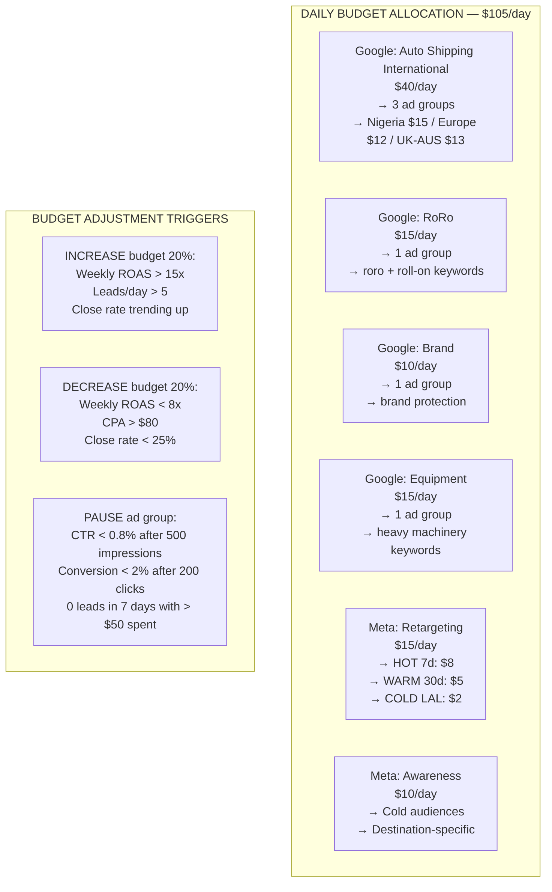

---

## Integration Map — Tools & Data Flow

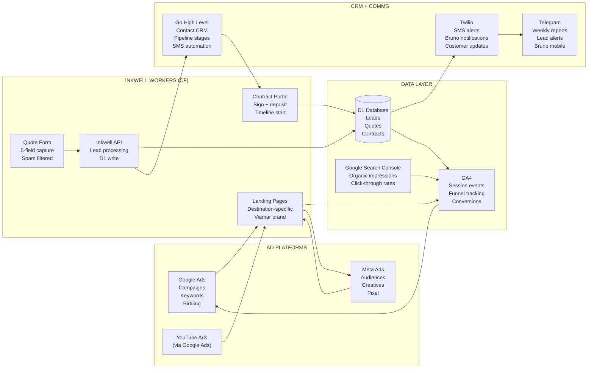

---

## Anomaly Detection — Alert Conditions

```
ALERT LEVEL: WARNING (review within 24 hours)
─────────────────────────────────────────────
• Daily leads < 2 (below baseline)
• CPC > $7.00 on any ad group
• Bounce rate > 65% on any landing page
• Quote form completion < 60%
• SMS delivery failure rate > 2%

ALERT LEVEL: CRITICAL (review same hour)
─────────────────────────────────────────────
• Daily leads = 0 (possible form break)
• D1 write failure (check Inkwell Worker logs)
• Twilio SMS not sending (Bruno not notified)
• Google Ads account suspended
• Landing page returning 5xx error

RESPONSE PROTOCOL
─────────────────────────────────────────────
Leads = 0 for 4 hours:
  1. Check D1 directly — any raw submissions?
  2. Check Inkwell API logs on CF dashboard
  3. Submit a test quote — does it appear in D1?
  4. Check form on mobile (most traffic is mobile)
  5. If broken: hotfix + re-deploy Inkwell worker

SMS not sending:
  1. Check Twilio dashboard — account balance?
  2. Check Inkwell Worker logs for Twilio errors
  3. If down: manually WhatsApp Bruno with lead data
  4. Fix underlying Twilio integration within 2 hours
```

---

## Launch Checklist

```
PRE-LAUNCH GATES (all must be green)
─────────────────────────────────────────────
[ ] Google Ads account created and billing confirmed
[ ] Conversion tracking installed via GA4 + Google Tag
[ ] Meta Pixel installed on all Viamar pages (verify in Pixel Helper)
[ ] D1 database initialized with leads schema
[ ] Inkwell quote form tested end-to-end (test lead appears in D1)
[ ] Twilio SMS tested (Bruno receives test notification)
[ ] GHL contact created on test lead submission
[ ] All 6 landing pages published on Inkwell (destination-specific)
[ ] Bruno briefed on: lead notification format, quote turnaround SLA (<24hr)
[ ] Weekly report Telegram channel confirmed

WEEK 1 FOCUS
─────────────────────────────────────────────
[ ] Launch brand campaign ($10/day) — low risk, measure baseline
[ ] Launch Nigeria ad group ($15/day) — highest demand, fastest data
[ ] Launch RoRo campaign ($15/day) — broad reach
[ ] Collect 50+ impressions before pausing any ad group

WEEK 2 ACTIONS
─────────────────────────────────────────────
[ ] Review CTR by ad group — kill below 0.8%
[ ] Add first round of negative keywords from search terms report
[ ] Launch retargeting on Meta once pixel has 200+ events
[ ] A/B test first ad copy variant (week 1 winner vs new challenger)

MONTH 1 TARGETS
─────────────────────────────────────────────
[ ] 30+ leads captured
[ ] 20+ quotes sent by Bruno
[ ] 5+ contracts signed
[ ] CPL < $40
[ ] CPA (cost per closed deal) < $150
[ ] Identify top 2 performing ad groups for budget reallocation
```

---

*This document is a living control spec. Update conversion rates monthly as real data accumulates. First 30 days: use industry benchmarks. Day 31+: use actuals from D1 + GHL.*
